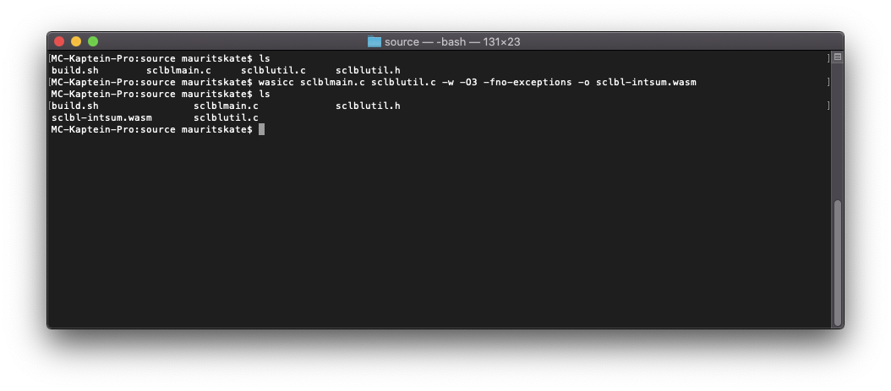
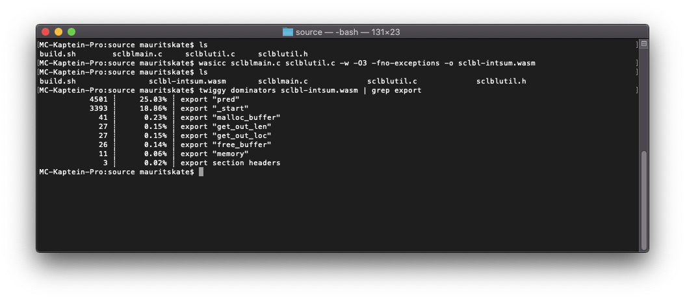
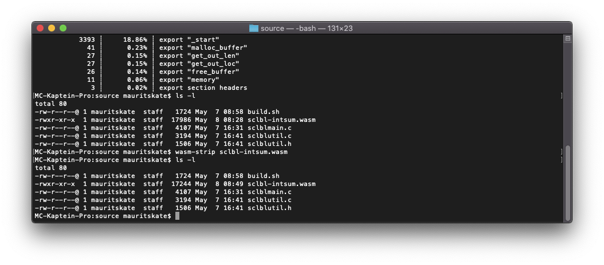
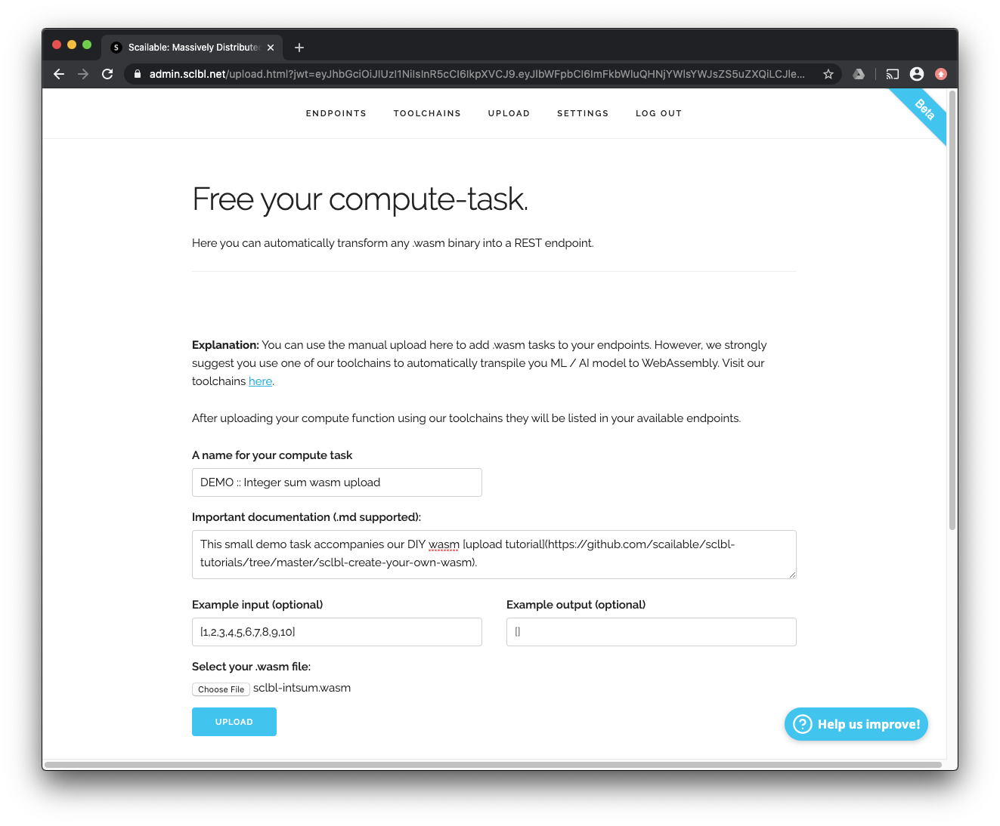
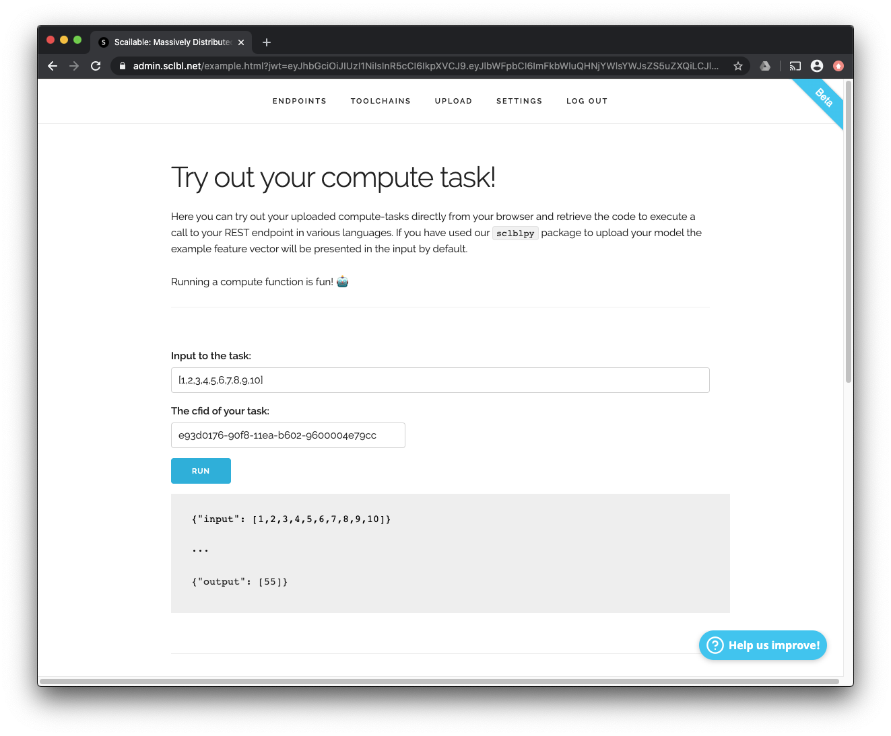
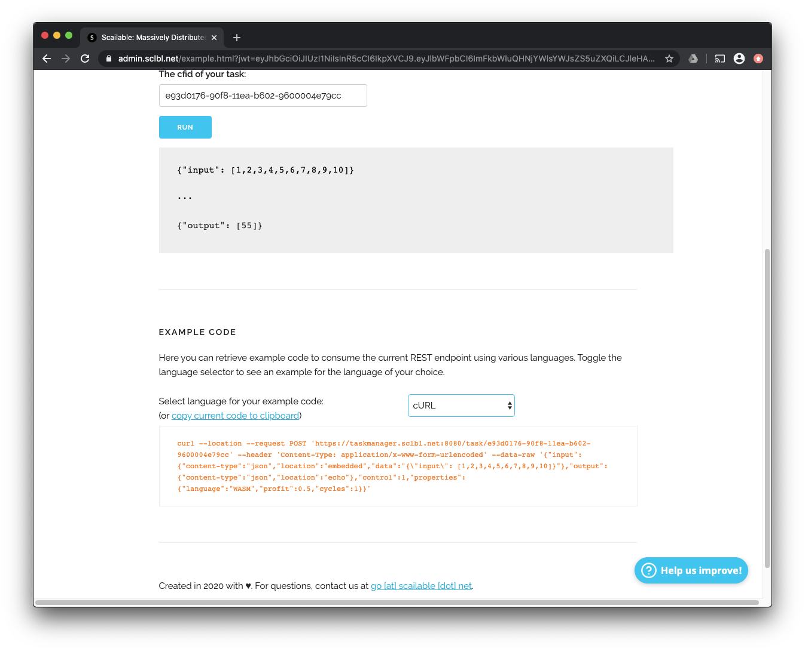
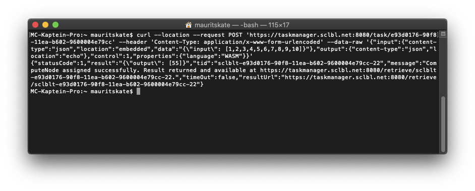

# Scailable Create your own WASM
> 07-05-2020; By the Scailable core team.

In this tutorial we explain, step-by-step, how you can create your own [WebAssembly](https://webassembly.org) executable and upload it to Scailable using our [manual upload functionality](https://admin.sclbl.net/upload.html). After uploading, you can directly use (or as we call it, *consume*) your executable using REST. The end-result of this tutorial is a functioning REST endpoint that allows you to [sum a list of integers](https://admin.sclbl.net/run.html?cfid=e93d0176-90f8-11ea-b602-9600004e79cc&exin=%5B1,2,3,4,5,6,7,8,9,10%5D). 

While most of our users use our packages (such as the [sclblpy package](https://pypi.org/project/sclblpy/)) to *automatically* compile machine learning models to WebAssembly, it is very well possible to create, upload, and use your own custom executable. In this tutorial we will create an executable using `c`, but you should be able to use any language that allows you to compile to WebAssembly (e.g., `rust`, `go`, `c++`). Deep knowledge of `c` is not required: throughout the tutorial we focus on the general principles that allow you to create an executable that you can upload on our platform, not on the language particularities.

In this tutorial we will cover the following steps:

1. We will first [conceptually describe the interactions between the `.wasm` executable and the surrounding runtime](#understanding) that are facilitated by the Scailable platform. This section should allow you to understand the minimal requirements your `.wasm` executable should have to allow it to be ran on the Scailable platform.
2. Next, we briefly discuss the [compilation of WebAssembly executables](#compilation). In this tutorial we will use [wasienv](https://github.com/wasienv/wasienv) for compilation.
3. After collecting all the necessary background knowledge we will dig into the `c` code. [We will take you through all the code required to write our integer sum functionality](#c-project) and we close this section off by compiling our newly created application to WebAssembly. You can find all the code [here](https://github.com/scailable/sclbl-tutorialss/tree/master/sclbl-create-your-own-wasm/source).
4. Finally, we will demonstrate how to [upload the resulting WebAssembly](#upload) executable to Scailable, and how to consume the [resulting REST endpoint]().

> **NOTE:** Throughout this tutorial we assume that you have access to a valid Scailable account (you can apply for one at [https://admin.sclbl.net](https://admin.sclble.net/signup.html)). If you have no clue how to use Scailable in the first place, we recommend you first check out our [Scailable 101: Getting started](https://github.com/scailable/sclbl-tutorials/tree/master/sclbl-101-getting-started) tutorial.

<a name="understanding"></a>
# 1. Understanding the WASM runtime

Before creating a `.wasm` executable and uploading it to Scailable to put it into production, it is important to understand how the Scailable *runtime* interacts with the `.wasm` *executable*. In this section we explain the interactions between the *runtime* and your `.wasm` *executable* that you need to understand to create your own *executable* from scratch. We effectively build on the WASI standards; read more about these [here](https://hacks.mozilla.org/2019/03/standardizing-wasi-a-webassembly-system-interface/).

> **NOTE:** In this section we will discuss the Scailable *runtime* in relatively general terms as Scailable does not use a single unique runtime. One of the beauties of compiling your functionality to WebAssembly is that it can be executed by different runtimes on various devices. We have runtimes available for our servers, browsers, and various IoT devices.

## Interactions between the *runtime* and the *executable*

Internally at Scailable we often think about the `.wasm` executables uploaded to our platform as specific functions that receive some input-data (i.e., a feature vector in the case of a ML model), operate on these input-data, and subsequently produce some output-data (i.e., the resulting inference). To create this functionality, the following interactions between the *runtime* and the *executable* need to be performed:

1. The *runtime* needs to initialize (and check) the *executable*. 
2. The *runtime* needs to send the input-data to the *executable*.
3. The *runtime* needs to tell the *executable* to execute its functionality (i.e., to operate on the input-data)
4. The *executable* needs to send the result back to the *runtime*.

WebAssembly executables that are uploaded to Scailable need to [export](https://medium.com/front-end-weekly/webassembly-part-3-different-ways-to-call-the-exported-function-in-webassembly-194830bad873) the right functions to allow these four steps to be executed smoothly; we will detail each step in turn.

> **NOTE:** If you are not interested in the concepts, but just want to know the necessary exported functions, click [here](#exported_functions).

<a name="_start"></a>
### 1. Initializing the executable

Since we are sticking to the current WASI standards (which are admittedly still a bit of a moving target), we assume that any `.wasm` executable that is uploaded to Scailable exports a function called `_start()`. The `_start()` function is the first function that is called when we initialize an executable. It can be used to initialize the task at hand, but in our tutorial it will simple return `c`'s `EXIT_SUCCESS`.

> **NOTE:** In the remainder of this tutorial, as we will be using the [WASIENV](https://medium.com/wasmer/wasienv-wasi-development-workflow-for-humans-1811d9a50345) toolchain to compile our `c` code to `.wasm`. This toolchain ensures that the `_start()` function is automatically added to the created executable and that the `_start()` function itself automatically calls the `main()` function.

### 2. Sending data to the executable
The beauty of WebAssembly is that the resulting executables are small, fast, and secure. One of the crucial aspects of the security is the fact that the interactions between the executable and the runtime are limited. Thus, interfacing and sending data between the runtime and the executable requires some care. In the Scailable platform we use a pretty low-level mechanism of sending data to our executables which is flexible and fast:

1. First, the *runtime* calls the function `malloc_buffer(int32_t length)` that is exported by the executable. The `length` argument indicates the length of the input data. This function should ensure that the executable allocates sufficient memory to store the input data it should return (a pointer to) the location of the allocated memory.
2. Next, the *runtime* will write the input to the memory that is reserved by the *executable*. Thus, the input data is never passed as an argument to a function, but rather it is stored in a location in memory that is reserved by the *executable* such that the *executable* can retrieve it at will. 
3. Once the *runtime* is done writing the input-data to the allocated memory buffer, it can now be accessed by the executable.

In our platform, the input-data itself is provided in the "data" field of the REST call to Scailable. Thus, in the following `cURL` call to a REST endpoint with id `9abcec1a-8f9e-11ea-b5eb-a4d18cd729d6` on our servers

```cURL
curl 
	--location 
	--request POST 'http://localhost:8080/task/9abcec1a-8f9e-11ea-b5eb-a4d18cd729d6'
	--header 'Content-Type: application/x-www-form-urlencoded' 
	--data-raw 
		'{
			"input": {
				"content-type": "json",
				"location": "embedded",
				"data": "{\"input\": [1,2,3,4,5]}"
			},
			"output": {
				"content-type": "json",
				"location": "echo"
			},
			"control": 1,
			"properties": {
				"language": "WASM",
				"profit": 0.5,
				"cycles": 1
			}
		}'
```
would write the JSON string `{"input": [1,2,3,4,5]}` to the allocated memory buffer that is accessible to the executable.

<a name="pred"></a>
### 3. Running the functionality / the task
After initializing the executable and making sure that the input-data is available, we run the actual functionality by calling the `pred()` function. Thus, the executable needs to export a function called `pred()` to run on the Scailable platform. 

The `pred()` function could implement pretty much any functionality you would like (as long as it's possible within the WASI standards). Note that we assume that the `pred()` function returns either `EXIT_SUCCESS` (or `EXIT_FAILURE` if it fails somewhere); thus, it does **not** return the actual output-data. 

<a name="get_out_len"></a>
### 4. Retrieving the result
The final step after sending data to the executable and running its functionality by calling the `pred()` function is retrieving the resulting output-data. This is similar to inserting data in the sense that we assume the `pred()` function to store its results somewhere in the memory that is accessible to the executable, and subsequently sharing the memory location with the runtime. To implement this the executable needs to export two functions:

1. The exported function `get_out_len()` should return the length of the output-data, and,
2. the exported function `get_out_loc()` should return the location of the output-data. 

The Scailable runtime will call these two functions in sequence and copy whatever was written to the allocated memory into the result of the REST api call to our platform. The cURL call described above will return:

```
{
	"tid":"sclblt-9abcec1a-8f9e-11ea-b5eb-a4d18cd729d6-88",
	"message":"{\"output\": [15]}"
}
```

where the JSON string `{"output": [15]}` is the string that was stored by the executable. 

### Mandatory cleaning

While the above functionality completes running an executable on our runtime(s), we also like to clean things up. Thus, we expect the executable to also export a function called `free_buffer(int32_t *p)` that can be called to free up the memory used for both the input-data and the output-data. 

<a name="exported_functions"></a>
## To summarize...

So, we hope the above somewhat clarified the interactions between the Scailable runtime(s) and the `.wasm` executable that you might upload. To summarize, any executable uploaded to Scailable should export the following 6 functions:

- `_start()` : Called to initialize the executable. Should return `EXIT_SUCCESS` and is by default inserted if you use [wasienv](https://github.com/wasienv/wasienv) for compilation.
- `pred()` : Called to run the actual task. Should return `EXIT_SUCCESS`.
- `malloc_buffer(length)` : Called to allocate memory for the input-data. Returns a pointer to the allocated memory.
- `free_buffer(location)` : Called to free up the allocated memory.
- `get_out_len()` : Called to retrieve the length of the output-data. Returns an integer.
- `get_out_loc()` : Called to retrieve the location of the output-data. Returns a pointer.

<a name="compilation"></a>
# 2. Compiling to WASM
Before we look at the actual working code to create our own `.wasm` executable using `c`, we briefly look at the tools for compilation. There are a few different options available, and one you will find around the web easily is the [Emscripten approach](https://developer.mozilla.org/en-US/docs/WebAssembly/C_to_wasm). While this works, this is very much geared towards creating `.wasm` executables that are ran in a `javascript` runtime. This approach nicely (in part) takes care of the input and output for you, but gives less out-of-the-box control than we like to optimize our executables. Also, as WebAssembly is becoming more popular, many [IDEs are also providing options to directly compile to WebAssembly](https://www.jetbrains.com/help/go/webassembly-project.html). It should not really matter which approach you use, as long as the right functions are exported.

We currently use the [wasienv](https://medium.com/wasmer/wasienv-wasi-development-workflow-for-humans-1811d9a50345) toolchain to compile from `c` (and `c++`) to `wasm`. Installing the toolchain should be simple (on OSX and Linux that is):

```curl
$ curl https://github.com/wasienv/wasienv/raw/master/install.sh -L| sh
```

Once installed you will have access to the shell commands `wasicc` and `wasic++` which effectively provide access to the `clang` compiler to run the compilation process with the correct compiler directives. As we see below, this pretty much works out-of-the-box for most `c` projects. Simply running

```
$ wasicc source.c -o output.wasm
```
Should compile whatever `source.c` specifies into the `output.wasm` executable. 

So, that's it pretty much (although we provide a few of our preferred compiler directives [below](#running_compile)).


<a name="c-project"></a>
# 3. A working `c` example

In this section we will take you, step-by-step, through the `c` code we used to generate our own custom `.wasm` executable that can be directly consumed on the Scailable platform. You can find the source code [here](source). Functionally, the resulting executable takes a string of integers separated by commas (for example `1,4,5,9`) and returns the sum of all the values (`19` in this case). Note that the input size in this example application is not fixed to demonstrate how to deal with varying input-data sizes.

We will first discuss the `c` code itself, and subsequently look at the compilation process.

## The integer sum `c` code

The code we use in this example is split over 3 files:

1. The file `sclblutil.c` contains a number of auxiliary functions that we created to implement integer sum functionality. These are mostly simple helper functions to (e.g.,) move between strings and integers, clean the input-data, and format the output-data. The function names are pretty much self-explanatory.
2. The file `sclblutil.h` is the header file for `sclblutil.c`.
3. The file `sclblmain.c` is where most of the actual functionality happens. This file contains the six required exported functions and the `sum()` function which carries out the core of the functionality.

> **NOTE:** The functionality implemented in `sclblutil.c` is also implemented in various `c` libraries; we have tried to keep this example very light-weight and thus wrote our own "essentials". This (e.g.,) means that we do very little checking and parsing of the input-data in this example. For most serious project we however use various existing libraries, such as [tiny-json](https://github.com/rafagafe/tiny-json), to make our life easier.

In the remainder of this tutorial we will focus on the content of the last file, `sclblmain.c`.

### Initializing
The top of the `sclblmain.c` file contains all the necessary initializations. It declare the EXPORT directive, includes the libraries that we use (including `sclblutil.h`), and defines the `main()` function:

```c
/ IMPORTANT:
// To export a function to WASM, make sure to set its function declaration's "used" attribute
# define EXPORT __attribute__((used));

// Include what we need (including our sclblutils)
#include <stdint.h>
#include <stdlib.h>
#include "sclblutil.h"

//  Initialize pointer(s) to position and length of input an output json strings in wasm linear (heap) memory
static int32_t *in_loc = NULL;
static int32_t *out_loc = NULL;
static int32_t out_len = 0;

// Potentially instantiate vars in main(), as it is automatically called by WASI _start() before any other function.
// We simply return EXIT_SUCCESS in this example.
int main() {
    return EXIT_SUCCESS;
}
``` 

The critical thing for instantiation here is the definition of the `main` function which is called when the `_start()` function is called (which itself is, as we [explained earlier](#_start), not explicitly defined but rather added by the `wasicc` compilation process).

### The input-data

Next, we declare and export the `malloc_buffer()` function which allows the runtime to request a pointer to a chunk of memory that is large enough to store the input-data:

```c
// malloc_buffer returns the location of the available memory of a specific 
//  length that can be used by the runtime to write the input-data
int32_t *malloc_buffer(int32_t length) EXPORT;
int32_t *malloc_buffer(int32_t length) {
    in_loc = (int32_t *) malloc(length * sizeof(uint8_t));
    return in_loc;
}
```

Again, the runtime will call this function and write the input-data to the returned location. Note our explicit export of the `malloc_buffer` function using `int32_t *malloc_buffer(int32_t length) EXPORT;`. Finally, note that the `in_loc` is both returned to the runtime *and* stored by the executable.

### The actual functionality

As [detailed above](#pred), the runtime, after writing the input-data to the shared memory, calls the `pred` function. It is defined as follows:

```c
// pred is the function that is called by the Scailable runtime to execute the actual functionality
// Note that this function is actively exported using the EXPORT declaration.
int pred() EXPORT;
int pred() {

    // First, we retrieve input string at in_loc
    // if none exists we exit
    const char *in_str;
    if (in_loc != NULL) {
        in_str = (char *) in_loc;
    } else {
        return EXIT_FAILURE;
    }

    // Next, we strip the input string of all characters but 1234567890,-
    const char *remove = "1234567890,-";
    str_clean(in_str, remove);

    // We subsequently pass the cleaned string to the sum function (defined below),
    int x = sum((char *) in_loc);

    // and convert the resulting int to a string.
    unsigned char *outstr = local_itoa(x);

    // Next, we create a nice output json
    char *out_str = str_concat(3, "{\"output\": [", outstr, "]}");

    // And finally we store, in the pointers we initialized earlier, the
    // location and length of the output.
    out_loc = (int32_t *) out_str;
    out_len = stringlength(out_str);

    // Done!
    return EXIT_SUCCESS;
}
```

The code -- at least including all the comments -- should be pretty self-explanatory. The core functionality relies on the following sum function:

```c
// sum takes a string containing integers and commas (i.e., 1,5,3,6,...)
//  and adds all the integers. This is the core functionality of our 
//  example.
int sum(const char *str) {
    int sum = 0;
    for (;;) {
        char *p;
        int n = strtol(str, &p, 10);
        if (p == str)
            break;
        sum += n;
        str = p + strspn(p, ", ");
    }
    return sum;
}
```

The function takes a string containing comma seperated integers, splits the string, converts the strings to int, and adds them. Clearly, this is no rocket science. However, please do noet that after the `sum()` function is called by the `pred()` function, the resulting sum is stored in memory, *and* both the location (`out_loc`) and length (`out_len`) of the memory are stored. These are used to by the runtime to retrieve the output-data.

### Returning the output-data
Again, as [explained above](#get_out_len), the runtime will ask the executable for the location and size of the output-data. This is implemented using two simple functions:

```c
// get_out_len retrieves output-data length
int32_t get_out_len() EXPORT;
int32_t get_out_len() {
    return out_len;
}

// get_out_loc retrieves (a pointer to) the location of the output-data
int32_t *get_out_loc() EXPORT;
int32_t *get_out_loc() {
    return out_loc;
}
```

Both of these functions are called by the runtime to retrieve the result of the executable.

### Cleaning up

Finally, the `free_buffer()` function allows the runtime to free up the memory:

```c
// free_buffer frees the allocated input and output memory
void free_buffer(int32_t *p) EXPORT;
void free_buffer(int32_t *p) {
    free(p);
    p = NULL;
}
```

The `free_buffer()` function is actually called twice by the runtime: once to free up the memory used for the input-data, and once to free up the memory used for the output-data.

At this point we are pretty much done writing our `c` code; so, let's look at the compilation!

<a name="running_compile"></a>
## Compiling the example to WebAssembly

Using the [wasienv](https://medium.com/wasmer/wasienv-wasi-development-workflow-for-humans-1811d9a50345) toolchain the actual compilation of our wasm executable is simple. Running the command 

```
$ wasicc sclblmain.c sclblutil.c -w -O3 -fno-exceptions -o sclbl-intsum.wasm
```
uses the provided toolchain to compile. We use a number of arguments: first, we specify the input files (`sclblmain.c` and `sclblutil.c`). Next, the `-w` flag disables all diagnostics, and the `-03` flag selects the compilers optimization type. The `fno-exceptions` argument instructs the compiler to ditch all exceptions as these are not supported in WebAssembly, and finally the `-o sclbl-intsum.wasm` argument specifies the name of the resulting executable. On my machine this looks like this:



Yay, the `.wasm` executable has been created!

### Additional tricks

While at this point in the tutorial we are effectively done and we have a `.wasm` executable that can be uploaded and run by Scailable, before we do so we explore a few more tricks that we often use. First, we often use [twiggy](https://rustwasm.github.io/twiggy/), a useful tool for inspecting the size and structure of your resulting executable. We can, for example, use it to find all the functions that are exported by the package by running (with a little tweak to grep only the exported functions from the full list):

```
twiggy dominators sclbl-intsum.wasm | grep export
```

Which, on my machine, give me the following:



And thus clearly shows that all the necessary functions are indeed exported by our executable.

Another useful set of tools for dealing with WebAssembly executables is [wabt](https://github.com/WebAssembly/wabt). This set of tools, amongst other things, allows one to use the `wasm-strip` command to strip an executable of unnecessary sections. Effectively, this makes the executable smaller and thus increases its performance on our platform:



<a name="upload"></a>
# 4. Uploading to Scailable

> **NOTE:** In this section we assume you have a valid Scailable beta account. If not, please sign up for one [here](https://admin.sclbl.net/signup.html).

Now that we have created our executable which implements all the necessary exported functions, we can easily upload it to Scailable and consume it using REST. First, we go to our [upload page]() where we fill out all the details of our task:



After successfully uploading, the task will show up in our available endpoints:


From here you can try out the endpoint directly from your browser:



Or, you can copy and past the code to consume the endpoint in various languages:



And finally, we can obviously curl it:



Yay! Success. We uploaded our own custom executable. You can play with it [here](https://admin.sclbl.net/run.html?cfid=e93d0176-90f8-11ea-b602-9600004e79cc&exin=%5B1,2,3,4,5,6,7,8,9,10%5D) and download the `.wasm` executable [here](https://cdn.sclbl.net:8000/file/e93d0176-90f8-11ea-b602-9600004e79cc.wasm).

----------


Thanks for your attention! Let us know if you have any questions by pressing the "Help us improve" button at [https://admin.sclbl.net](https://admin.sclbl.net) or emailing us at [go at scailable dot net](mailto:go@scailable.net).

If you find any mistakes in our tutorials, please do [add an issue](https://github.com/scailable/sclbl-tutorials/issues/new) so we can fix it asap!


