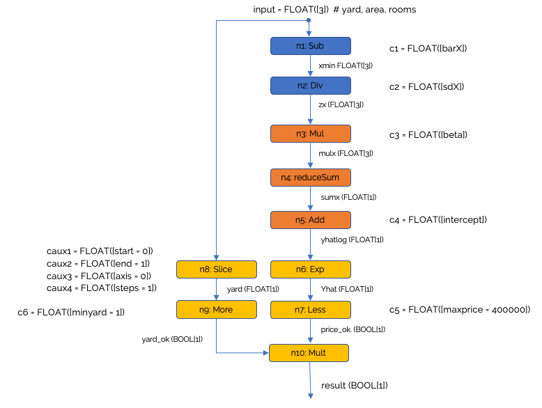
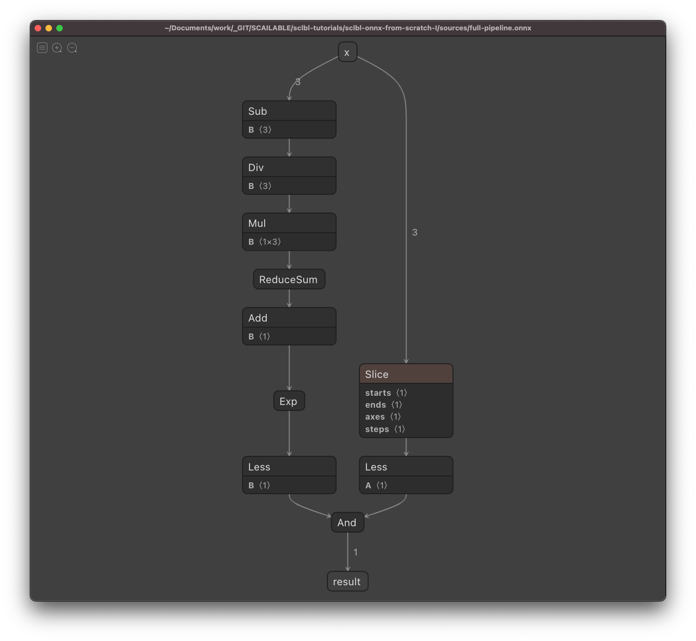

# ONNX from scratch 1: Designing a regression pipeline
> 05-02-2020; This tutorial is also available on Medium.

[ONNX]() has been around for a while, and it is becoming a succesfull intermediate format to move, often heavy, trained neural networks from one training tool to another (e.g., move between pyTorch and Tensorflow), or to deploy models in the cloud using the ONNX runtime. In these cases users often simple save a model to ONNX format, without worrying about the resulting ONNX graph. 

However, ONNX can be put to a much more versatile use: ONNX can easily be used to manually specify AI/ML processing pipelines, including all the pre- and post-processing that is often neccesary for real-world deployments. Additionally, due to its standardized and open structure, a pipeline stored in ONNX can easily be deployed, even on edge devices (by automatic compilation to WebAssembly for efficient deployment on various targets). In this tutorial we will show how to use the `onnx` `helper` tools in `python` to create a ONNX pipeline *from scratch* and deploy it efficiently.

The tutorial consists of the following parts:

1. Some background on ONNX. Before we start it is usefull to conceptually understand what ONNX does.
2. The "house-hunt" scenario. In this tutorial we will focus on creating a pipeline to predict the price of an advertised house, and subsequently judge it the house fits within our search constraints. 
3. Model training. Although not really part of the deployment pipeline, we will show how we used `sklearn` to train the prediciton model.
4. Creating the ONNX pipeline. We will take it step-by-step:
	- Preprocessing: we will standardize the inputs using the results from our training.
	- Inference: we will predict the (log) price using the model fitted during training.
	- Post-processing: we will check whether the results fit with our desiderata.
	- Putting it all togehter: we will merge the pre-processing, inference, and post-processing pipelines into one ONNX graph.
5. Deploying the model: one can use the ONNX runtime to deploy ONNX models, or optimize the fitted graph and deploy using WebAssembly. We will briefly explore both options.

## 1. What is ONNX?
According to the official ONNX website:

*"ONNX is an open format built to represent machine learning models. ONNX defines a common set of operators - the building blocks of machine learning and deep learning models - and a common file format to enable AI developers to use models with a variety of frameworks, tools, runtimes, and compilers."* (see [onnx.ai](https://onnx.ai)).

Thus, ONNX is an open file format to store (**trained**) machine learning models/pipelines containing sufficient detail (regarding data types etc.) to move from one platform to another. The specificity of ONNX even allows one to automatically compile the stored operations to lower level languages for embedding on various devices. Effectively, an `onnx` file will contain all you need to know to reinstantiate a full procesing data processing pipeline when moving from one platform to the other.

Conceptually, the ONNX format is easy enough: An onnx file defines a [directed graph]() in which each edge reprents a tensor with a specific type that is "moving" from one node to the other. The nodes themselves are called operators and they opertate on their inputs (i.e., the results of their parents in the graph), and submit the result to their children. ONNX specifies a [list of operations]() which jointly allow one to specify virtually any AI/ML operation you might want to carry out (and if not, the set of operators is easily extendable).

To provide a simple, conceptual, example, suppose we would like to generate inferences from a logistic regression model. Given an input vector `x` we would:

* Compute the linear predictor `ylin` using for example the `Gemm` operator to multiple our input vector `x` by the learned coefficients `beta`
* Transform the linear predictor to probablity scale using the `Sigmoid` operator.
* Generate inference true or false using the `Less` operator.

Thus, by chaining a number of operators, we can generate a predictions given some feature vector. Don't be fooled by the simplicity of the example however: due to ONNXs tensor support and extensive list of operators even complex DNNs for video processing can be represented in ONNX.

## 2. Our house-hunt scenario
To demonstrate how to create ONNX graphs from scratch, we introduce a simple scenario:

*"Suppose you are looking for a new house in your neighborhood. Given a dataset of previous house sales containing the yard-size `yard`, living area `area`, and number of rooms `rooms` of sold houses and their prices `price`, construct a model to predict the price of a newly advertised house (i.e., you are given only the yard-size, area, and number of rooms). Next, you are interested in any house that is available for less than 400.000 euros, and has a yard (i.e., the yard-size is larger than 0)."*

In this tutorial we will construct a data processing pipeline, including a linear regression model for inference, which given an input vector `(yard,area,rooms)` provide a boolean value indicating whether or not the house is of interest.

## 3. Model training
To create the pipeline, we will first need to create the model that we are using to predit the prices. The code below opens the data file `houses.csv` and generates the model. Note that we preform several steps:

* We standardize the inputs (thus, for destandardization in our pre-processing pipeline we will need the `mean` and `std` of each of the input variables).
* We log transform the prices (thus, in our post-processing pipeline we will need to transform our inference back to the correct scale).
* We fit a simple linear regression model (and we store the estimated coefficients for use in our processing pipeline.

Here is the code (or [click here]() for the full notebook):

```python
import numpy as np
from sklearn import linear_model as lm

# Open the training data:
data = np.loadtxt(open("houses.csv", "rb"), delimiter=",", skiprows=1)

# Retreive feature vectors and outcomes:
datX = data[:, [1,2,3]]  # Input features (yard, area, rooms)
datY = data[:, [0]]  # Price

# Standardize the inputs:
barX = np.mean(datX, 0)  # Mean for each of the inputs
sdX = np.std(datX, 0)  # Sd for each of the inputs
datZ = (datX - barX) / sdX

# Log transform the output
logY = np.log(datY)

# Fit a linear model
lin_mod = lm.LinearRegression()
lin_mod.fit(datZ, logY)

# retrieve intercept and fitted coefficients:
intercept = lin_mod.intercept_
beta = lin_mod.coef_

## Storing what we need for inference in our processing pipeline.
print("--- Values retrieved from training --- ")
print("For input statdardization / pre-processing we need:")
print(" - The column means {}".format(barX))
print(" - The column sds {}".format(sdX))

print("For the prediction we need:")
print(" - The estimated coefficients: {}".format(beta))
print(" - The intercept: {}".format(intercept))

# store the training results in an object to make the code more readable later on:
training_results = {
    "barX" : barX.astype(np.float32),
    "sdX" : sdX.astype(np.float32),
    "beta" : beta.astype(np.float32),
    "intercept" : intercept.astype(np.float32),
}

# And, also creating the constraints (for usage in block 3):
constraints = {
    "maxprice" : np.array([400000]),
    "minyard" : np.array([1]),
}
```

While the `training_results` and `constraints` objects are all we need from this training stage to subsequently implement our processing pipeline in ONNX, it is instructive to demonstrate how one would generate inferences without converting to ONNX. The following code demonstrates the full pipeline we aim to build using simple python code and using the first instance in our training set as an example:

```python
# Get the data from a single house
first_row_example = data[1,:]
input_example = first_row_example[[1,2,3]]  # The features
output_example = first_row_example[0]  # The observed price  

# 1. Standardize input for input to the model:
standardized_input_example = (input_example - training_results['barX'])/ training_results['sdX']

# 2. Predict the *log* price (using a dot product and the intercept)
predicted_log_price_example = training_results['intercept'] + np.dot(standardized_input_example, training_results['beta'].flatten())


# Compute the actual prediction on the original scale
predicted_price_example = np.exp(predicted_log_price_example)
print("Observed price: {}, predicted price: {}".format(output_example, predicted_price_example))

# See if it is interesting according to our simple decision rules:
interesting = input_example[1] > 0 and predicted_price_example < 400000
print("Interesting? {}".format(interesting))
```

## 4. Creating the ONNX pipeline. 
Our ONNX pipeline should, given an example instance described by an input vector of length 3 (`yard,area,rooms`):

1. [pre-processing] Standardize the input by substracting the mean (as observed in the training set) and dividing by the standard deviation.
2. [inference] Predict the houst price of the example instance on the log scale (using the coefficients from the trained `sklearn` model).
3. [post-processing] Transform the price back to the original scale and check wether a) the house is affordable, and b) whether it has a yard.

To be more precise, and introduce the ONNX operators used, we will be generating the following pipeline:



Note that in the code blocks below we will use the naming conventions introduced in this image.

### 4a. Pre-processing
We will use the `onnx.helper` tools provided in `python` to construct our pipeline. We first create the constants, next the operating nodes (although constants are also operators), and subseqeuntly the graph:

```python
# The required constants:
c1 = h.make_node('Constant', inputs=[], outputs=['c1'], name="c1-node", 
        value=h.make_tensor(name="c1v", data_type=tp.FLOAT, 
        dims=training_results['barX'].shape, 
        vals=training_results['barX'].flatten()))

c2 = h.make_node('Constant', inputs=[], outputs=['c2'], name="c2-node", 
        value=h.make_tensor(name="c2v", data_type=tp.FLOAT, 
        dims=training_results['sdX'].shape, 
        vals=training_results['sdX'].flatten()))

# The functional nodes:
n1 = h.make_node('Sub', inputs=['x', 'c1'], outputs=['xmin'], name='n1')
n2 = h.make_node('Div', inputs=['xmin', 'c2'], outputs=['zx'], name="n2")

# Create the graph
g1 = h.make_graph([c1, n1, c2, n2], 'preprocessing',
        [h.make_tensor_value_info('x', tp.FLOAT, [3])],
        [h.make_tensor_value_info('zx', tp.FLOAT, [3])])

# Create the model and check
m1 = helper.make_model(g1, producer_name='scailable-demo')
checker.check_model(m1)

# Save the model
save(m1, 'pre-processing.onnx')
```
The code above creates the pre-processing pipeline and stores it in `onnx` format. From `python` we can directly test the stored model using the `onnxruntime`:

```python
# A few lines to evaluate the stored model, useful for debugging:
import onnxruntime as rt

# test
sess = rt.InferenceSession("pre-processing.onnx")  # Start the inference session and open the model
xin = input_example.astype(np.float32)  # Use the input_example from block 0 as input
zx = sess.run(["zx"], {"x": xin})  # Compute the standardized output

print("Check:")
print("The standardized input using onnx pipeline is: {}".format(zx))
print(" - Compare to standardized first row in block 0: {}".format(datZ[1,:]))
```
Which, when evaluated, shows that our pre-processing pipeline indeed properly standardizes the example instance.

### 4b. Inference

After creating our pre-processing pipeline, we follow a similar approach to create the inference pipeline:

```python
# The constants:
c3 = h.make_node('Constant', inputs=[], outputs=['c3'], name="c3-node", 
        value=h.make_tensor(name="c3v", data_type=tp.FLOAT, 
        dims=training_results['beta'].shape, 
        vals=training_results['beta'].flatten()))

c4 = h.make_node('Constant', inputs=[], outputs=['c4'], name="c4-node", 
        value=h.make_tensor(name="c4v", data_type=tp.FLOAT, 
        dims=training_results['intercept'].shape, 
        vals=training_results['intercept'].flatten()))

# The operating nodes, Multiply, reduceSum, and Add
n3 = h.make_node('Mul', inputs=['zx', 'c3'], outputs=['mulx'], name="multiplyBeta")
n4 = h.make_node('ReduceSum', inputs=['mulx'], outputs=['sumx'], name="reduceSum", keepdims=0)
n5 = h.make_node('Add', inputs=['sumx', 'c4'], outputs=['yhatlog'], name='addIntercept')

# The graph
g2 = h.make_graph([c3, c4, n3, n4, n5], 'linear_regression',
       [h.make_tensor_value_info('zx', tp.FLOAT, [3])],
       [h.make_tensor_value_info('yhatlog', tp.FLOAT, [1])])

# The model and check:
m2 = h.make_model(g2, producer_name='scailable-demo')
checker.check_model(m2)

# Save the model
save(m2, 'linear-regression.onnx')
```

Again, it is easy to verify the predictions are correct:

```python
# test
sess = rt.InferenceSession("linear-regression.onnx")  # Start the inference session and open the model
xin = standardized_input_example.astype(np.float32)  # Use the input_example from block 0 as input
yhatlog = sess.run(["yhatlog"], {"zx": xin})  # Compute the standardized output

print("Check:")
print("The log predicted price from ONNX is: {}".format(yhatlog))
print(" - Compare to analysis in block 0: {}".format(predicted_log_price_example))
```

### 4c. Post processing

The post processing pipeline is a bit more involved as it checks whether the house fits our desiderata (i.e., `predicted_price < 400000` and `yard > 0` and thus uses various input sources (and not that the slice operator is a bit involved):

```python
# Constants (note using the constraints object created in block 0 above)
c5 = h.make_node('Constant', inputs=[], outputs=['c5'], name="c5-node", 
        value=h.make_tensor(name="c5v", data_type=tp.FLOAT, 
        dims=constraints['maxprice'].shape, 
        vals=constraints['maxprice'].flatten()))
c6 = h.make_node('Constant', inputs=[], outputs=['c6'], name="c6-node", 
        value=h.make_tensor(name="c6v", data_type=tp.FLOAT, 
        dims=constraints['minyard'].shape, 
        vals=constraints['minyard'].flatten()))

# Auxilary constants for the slice operator:
caux1 = h.make_node('Constant', inputs=[], outputs=['caux1'], name="caux1-node",
        value=h.make_tensor(name='caux1v', data_type=tp.INT32,
        dims=np.array([0]).shape, vals=np.array([0]).flatten()))
caux2 = h.make_node('Constant', inputs=[], outputs=['caux2'], name="caux2-node",
        value=h.make_tensor(name='caux2v', data_type=tp.INT32,
        dims=np.array([1]).shape, vals=np.array([1]).flatten()))
caux3 = h.make_node('Constant', inputs=[], outputs=['caux3'], name="caux3-node",
        value=h.make_tensor(name='caux3v', data_type=tp.INT32,
        dims=np.array([0]).shape, vals=np.array([0]).flatten()))
caux4 = h.make_node('Constant', inputs=[], outputs=['caux4'], name="caux4-node",
        value=h.make_tensor(name='caux4v', data_type=tp.INT32,
        dims=np.array([1]).shape, vals=np.array([1]).flatten()))
            
# Nodes:
n6 = h.make_node('Exp', inputs=['yhatlog'], outputs=['yhat'], name='exponent')
n7 = h.make_node('Less', inputs=['yhat', 'c5'], outputs=['price_ok'], name='priceLess')

n8 = h.make_node('Slice', inputs=['x', 'caux1', 'caux2', 'caux3', 'caux4'], outputs=['yard'],)
n9 = h.make_node('Less', inputs=['c6', 'yard'], outputs=['yard_ok'], name="yardMore") # note reversal

n10 = h.make_node('And', inputs=['price_ok', 'yard_ok'], outputs=['result'], name='andBools')

# The graph
g3 = h.make_graph([c5, c6, caux1, caux2, caux3, caux4, n6, n7, n8, n9, n10], 'postprocessing',
       [h.make_tensor_value_info('x', tp.FLOAT, [3]), h.make_tensor_value_info('yhatlog', tp.FLOAT, [1])],
       [h.make_tensor_value_info('result', tp.BOOL, [1])])

# The model and check:
m3 = h.make_model(g3, producer_name='scailable-demo')
checker.check_model(m3)

# Save the model
save(m3, 'post-processing.onnx')
```

Again, the results are easy to verify:

```python
# test
sess = rt.InferenceSession("post-processing.onnx")  # Start the inference session and open the model
x = input_example.astype(np.float32)  # Use the input_example from block 0 as input

yhatlog = np.array(yhatlog).flatten()
result = sess.run(["result"], {"x": x, "yhatlog" : yhatlog})  # Compute the standardized output

print("Check:")
print("Predicted price {} and yardsize {} are appealing {}.".format(np.exp(yhatlog), input_example[0], result))
```

### 4d. Putting it all together
While it is nice to have each part of the processing pipeline converted to ONNX for easy deployment, one of the powers of ONNX is the ability to chain one set of operations to another. Hence, we can easily specify our full pipeline into one ONNX graph:

```python
g_full = h.make_graph([c1, n1, c2, n2, c3, c4, n3, n4, n5, c5, c6, caux1, caux2, caux3, caux4, n6, n7, n8, n9, n10], 
        'fullpipeline',
        [h.make_tensor_value_info('x', tp.FLOAT, [3])],
        [h.make_tensor_value_info('result', tp.BOOL, [1])])

m_full = h.make_model(g_full, producer_name='scailable-demo')
checker.check_model(m_full)

# Save the model
save(m_full, 'full-pipeline.onnx')
```

Again, it is easy to verify our result:

```python
# test
sess = rt.InferenceSession("full-pipeline.onnx")  # Start the inference session and open the model
xin = input_example.astype(np.float32)  # Use the input_example from block 0 as input

yhatlog = np.array(yhatlog).flatten()
result = sess.run(["result"], {"x": xin})  # Compute the standardized output

print("Check:")
print("Example {} is appealing: {}.".format(xin, result))
```

The code below demonstrates the the first house in our dataset is not expected to fit with our desiderata as the predicted price exceeeds 400.000E.

When viewed using [Netron](), our resulting ONNX pipeline looks like this:



## 5. Deployment.
Above we hope to have shown how ONNX is not just some abstract file format used under-the-hood by various complex AI training tools: it is also an easy to construct pre- and post-processing pipelines manually by chaining ONNX blocks together. Thus, ONNX is a super effective tool to create data analyis pipelines that can be used anywhere.

Once you have an ONNX pipeline, various options are available for its deployment:

1. You could use the `onnxruntime` (which is what we have been using in some of the quick tests above). If you want to deploy on the cloud, one option would be to create a simple REST endpoint (using for example [Flask]) that executes the `onnxruntime` and deploy it using Docker. While this is relatively easy, it is also often quite inefficient (and memory consuming).
2. You can use tools such as those offered by Scailable to transpile your ONNX model to WebAssembly for extremely efficient deployment. Effectively, due to its level of detail, ONNX makes it possible to generate stand-alone executables in lower level languages automatically based on an ONNX graph. This provides native execution speed (when ported e.g., to `c`) and (when ported to a portable target like `.wasm`) allows you to move the exact same model from the cloud to the edge and even to small (I)IoT devices. 

Pretty cool.

To finish off, just a small size and speed comparison. 

* The full ONNX pipeline we created above consumes a little under 1Kb in memory. However, to run, the `onnxruntime` itself requires a bit over 200**M**b. Using this memory footprint, I can, on my local machine, execute our pipeline 1000 times in 1.9 seconds (when restarting the session anew each time).
* Using conversion to WebAssebmly (as done out-of-the-box by [Scailable]()) the memory footprint is about 70Kb for the `.wasm` binary (which is larger than the `onnx` specificaiton as it **includes** the neccesary operators) but only 60Kb for the runtime. Thus, in total less than < 0.01 Mb. Using this memory footprint I can, on the same local machine, generate 1000 inferences in .7 seconds (similarly reloading anew each time; with reloading the difference between the ONNX and WebAssembly runtimes is neglectible). 

So yeah, combining ONNX with WebAssembly provides expressiveness (ONNX) and efficiency (WASM), across all targets.

I hope you enjoyed this tutorial; feel free to reach out with any ONNX / WebAssembly deployment related questions!


