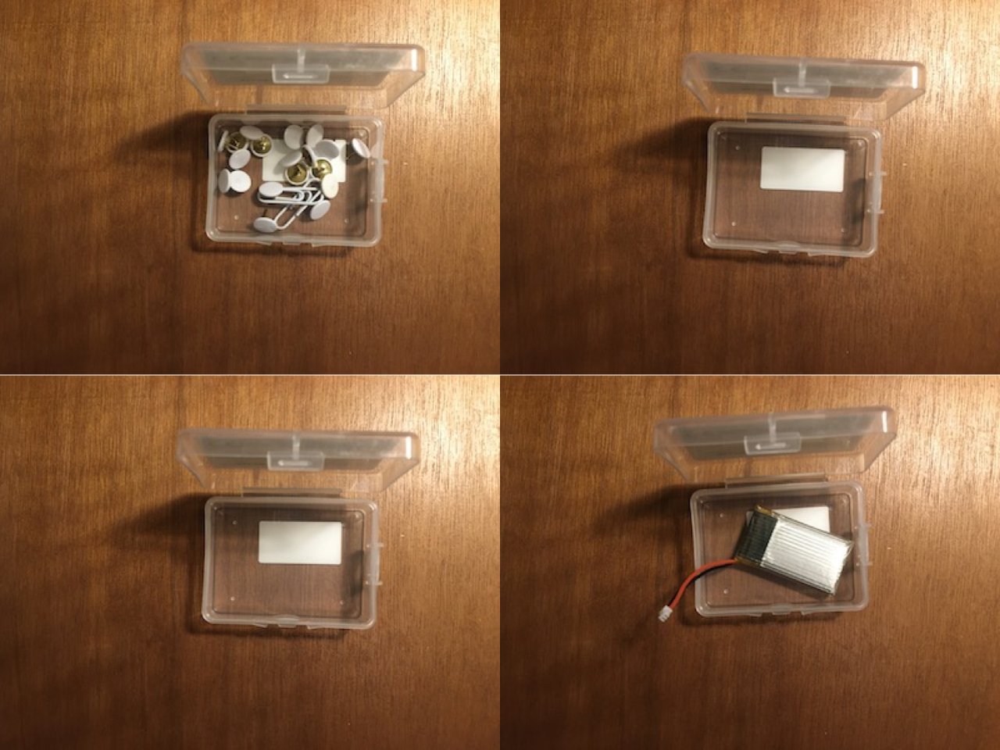
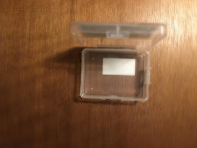
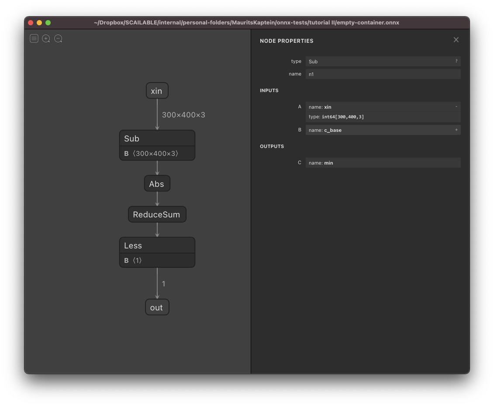
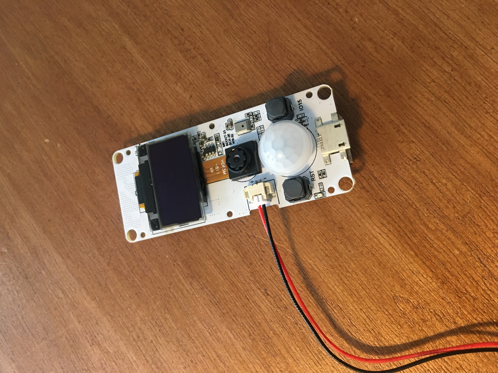

# ONNX from scratch 2: Rudimentary image processing
> 08-02-2021; This tutorial is also available on Medium.

[ONNX](https://onnx.ai) has been around for a while, and it is becoming a successful intermediate format to move, often heavy, trained neural networks from one training tool to another (e.g., move between [pyTorch](https://pytorch.org) and [Tensorflow](https://www.tensorflow.org)), or to deploy models in the cloud using the [ONNX runtime](https://github.com/microsoft/onnxruntime). However, ONNX can be put to a much more versatile use: ONNX can easily be used to *manually* specify AI/ML processing pipelines, including all the pre- and post-processing that is often necessary for real-world deployments. In this tutorial we will show how to use the `onnx helper` tools in Python to create a ONNX image processing pipeline *from scratch* and deploy it efficiently.

In this tutorial we will not introduce ONNX again; please see our "[ONNX from scratch" tutorial](https://github.com/scailable/sclbl-tutorials/blob/master/sclbl-onnx-from-scratch-I/README.md) for a general introduction. In this tutorial we will show how to easily use ONNX to specify image processing pipelines. We will cover the following steps:

1. Pipeline "training": We will explain the image recognition task we are facing and our general approach.
2. ONNX creation: We will detail, step-by-step, how we create the ONNX pipeline to carry out the desired image processing.
3. Testing within python: We will demonstrate how to test our pipeline in Python using the ONNX runtime.
4. Deployment using WebAssembly: We will demonstrate how to convert our image processing pipeline to WebAssembly for efficient deployment in the browser, in the cloud, or on embedded devices.

Note that the main aim of this tutorial is to show the ease with which ONNX can be used to specify data processing tasks (in this case image processing) that would often not be regarded as AI/ML, but are still extremely useful. Hopefully this helps to open up the use of ONNX far beyond the simple storing of trained neural networks.

## 1. Pipeline "training"
It is hard to really call the steps below model training, but we start by setting up the problem including the processing we need for the classification algorithm that we will implement in ONNX. In this toy example, we are faced with a total of [14 images](sources/) of a small container which is either empty or full. Our goal is to create an ONNX pipeline (and deploy it) which, given an input image, detects whether or not the container is filled. Here are some examples:



Our approach is super simple: we first compute the average of all the empty images to use as a reference. Next, for each new image we simply subtract the new image from the reference image and see if it deviates (too much) from it: if it does, it must not be an empty image. 

> Note that the image processing approach we implement in this tutorial is very rudimentary; it is not very robust to changes in (e.g.,) the lighting of the image, nor would it work well with different containers. However, the example does go to show the ease with which processing pipelines can be created in ONNX.

Using Pillow and Numpy our "training" stage is relatively simple: we simply open up all the empty containers and compute their average:

```python
import numpy as np
from PIL import Image

## Setup:
image_folder = "images/"
empty_containers = [2,3,5,8,9,12,13]
full_containers = [1,4,6,7,10,11,14]
all_containers = empty_containers+full_containers

# Get number of images, image width, and image height:
n_empty = len(empty_containers)
image_width, image_height=Image.open(image_folder + str(empty_containers[0])+".JPG").size


# Create a numpy array of ints to store the average (assume RGB images)
av_arr=np.zeros((image_height,image_width,3),np.int64)

# Build up average pixel intensities, casting each image as an array of ints
for i in empty_containers:
    im_arr=np.array(Image.open(image_folder + str(empty_containers[0])+".JPG"),dtype=np.int64)
    av_arr=av_arr+im_arr/n_empty

# Round values in array and cast as 8-bit integer
av_arr=np.array(np.round(av_arr),dtype=np.uint8)

# Generate and save the average empty container image
out=Image.fromarray(avarr,mode="RGB")
out.save(image_folder+"empty-average.JPG")
out.show()
```

The "empty-average.JPG" will be used as our reference. It looks like this:



# 2. ONNX Pipeline creation
We will use ONNX *from scratch* using the `onnx.helper` tools in Python to implement our image processing pipeline. Conceptually the steps are simple:

1. We subtract the "empty-average.JPG" from a given image that we would like to classify.
2. We compute the absolute value of the remaining difference.
3. We sum the array of image (absolute) color values in the difference to a single number.
4. We check if the number is larger than some threshold.

Thus, the logic of this implementation is simple: compared to the (average) empty image, an image of an empty container should be relatively similar, i.e., its absolute difference should be small. If however the container is full, the image is different, and thus its summed absolute difference compared to the reference image should be large.

The python code to implement this pipeline is as follows:

```python
# The imports used in this block
from onnx import helper as h
from onnx import TensorProto as tp
from onnx import checker
from onnx import save


# 1. We start by opening the reference image and creating the necessary ONNX constants:

# The baseline empty container image (average of the 7 empty images)
reference_image=np.array(Image.open(image_folder+"empty-average.JPG"),dtype=np.int64)

# The baseline image as ONNX constant:
c_base = h.make_node('Constant', inputs=[], outputs=['c_base'], name="c_base_node", 
        value=h.make_tensor(name="c_base_value", data_type=tp.INT64, 
        dims=reference_image.shape, 
        vals=reference_image.flatten()))

# The threshold value as ONNX constant; here we select an average of 25 points difference (3000000=300*400*25)
image_threshold = numpy.array([3000000]).astype(numpy.int64)
c_cut = h.make_node('Constant', inputs=[], outputs=['c_cut'], name="c_cut_node", 
        value=h.make_tensor(name="c1v", data_type=tp.INT64, 
        dims=image_threshold.shape, 
        vals=image_threshold.flatten()))


# 2. Next, we declare the functional ONNX nodes in order of appearance:

# Subtract input xin from baseline
n1 = h.make_node('Sub', inputs=['xin', 'c_base'], outputs=['min'], name='n1')  

# Compute absolute values of the remaining difference
n2 = h.make_node('Abs', inputs=['min'], outputs=['abs'], name="n2")  

# Sum all the absolute differences
n3 = h.make_node('ReduceSum', inputs=['abs'], outputs=['sum'], name="n3", keepdims=0)  

# See if the sum is less than image_threshold; if it is the image is empty
n4 = h.make_node('Less', inputs=['sum','c_cut'], outputs=['out'], name="n4")  


# 3. Finally, we create the resulting ONNX graph

# Create the graph
g1 = h.make_graph([c_base, c_cut, n1,n2,n3,n4], 'convert_image',
        [h.make_tensor_value_info('xin', tp.INT64, target.shape)],
        [h.make_tensor_value_info('out', tp.BOOL, [1])])

# Create the model and check
m1 = h.make_model(g1, producer_name='scailable-demo')
checker.check_model(m1)

# Save the model
save(m1, 'empty-container.onnx')
```

With [Netron](https://netron.app) we can inspect the resulting ONNX pipeline:



# 3. Testing within python
Before detailing how this pipeline can be used on (e.g.,) a small ESP32 device for actual image processing "in the field", we first want to see its performance. In total we have 14 test images, 7 empty, and 7 full. The following python code uses the `onnxruntime` to check each of the images and print whether or not our processing pipeline thinks it is empty:

```python
# A few lines to evaluate the stored model, useful for debugging:
import onnxruntime as rt

# Open the model:
sess = rt.InferenceSession("empty-container.onnx")  

# Test all the empty images
print("Iterating through all images")
for i in all_containers:
    
    # Get whether in reality the container is empty
    true_empty = i in empty_containers
    
    # Check image using the ONNX pipeline
    target=numpy.array(Image.open(image_folder + str(i)+".JPG"),dtype=numpy.int64)    
    out = sess.run(["out"], {"xin": target.astype(numpy.int64)})  
    print("Container {} is empty {}, and it is classified as empty {}.".format(i, true_empty, out[0].flatten()))
```

Running the code shows that all the example images are correctly "classified".

# 4. Deployment using WebAssembly
Up until this point we hope this tutorial has shown how simple it is to create a rudimentary image processing pipeline using ONNX. Thus, ONNX can be used to not only store complex AI/ML models, it is also a very useful tool to express pre- and post-processing in a general data pipeline. 

However, ONNX, in our view, is not very well suited to subsequently deploy the resulting pipeline. Although in the cloud the `onnxruntime` works well, it is quite bloated (one needs > 200Mb to just install the runtime itself). On (I)IoT and/or Edge devices, where simple image processing tasks such as the one described in this tutorial are extremely common, there is no way you will be able to deploy the full ONNX runtime. 

Does that mean ONNX is useless for deployment on embedded devices? Nope, not at all! Because of the level of detail of an ONNX graph (i.e., strongly typing etc.), it is possible to **automatically convert an ONNX graph to a lower level representation** (for example, to [LLVM IR](https://github.com/scailable/sclbl-tutorials/blob/master/sclbl-create-your-own-wasm/README.md) really). Actually, it is possible to go from ONNX directly to `c` to embed the pipeline on extremely small devices. Or, the option that we prefer, we compile from `c` to WebAssembly: by compiling to WebAssembly we can now take the specified ONNX pipeline and run it without difficulties on virtually any device; here the WebAssembly runtime will take care of the differences in Chipsets (e.g., Intel vs. Arm, 32 vs. 64 bits, etc.) that we often face on Edge devices.

Using the tools offered by Scailable (you can sign up for a free account [here](http://www.scailable.net)), the conversion from ONNX to WebAssembly is out-of-the box. The pipeline above provides me with [a `.wasm` binary](b5b78d9b-69e9-11eb-858e-9600004e79cc.wasm) adhering to the interface standards described [here](https://github.com/scailable/sclbl-tutorials/blob/master/sclbl-create-your-own-wasm/README.md). Subsequently, it is easy to embed this binary in e.g., a simple `c` project:

```c
int main(int argc, char *argv[]) {

	// ...

	// 1. Read WASM into runtime.
	sclbl_core_wasm_read(wasm_path);

	// 2. Initialize runtime.
	sclbl_core_wasm_init();

	// 3. Generate JSON formatted runtime input string.
	char *input_string = sclbl_util_bmp_to_json(bmp_path);

	// 4. Run Sclbl inference.
	char *output_string = sclbl_core_exec(input_string);

	// 5. Do something with the output string.
	printf("%s\n", output_string);

	// 6. Clean up.
	sclbl_core_finalize();

}

char *sclbl_util_bmp_to_json(char *imgPath) {

	// ...

	// read bmp file 
	sclbl_read_bmp(imgPath, &pixels, &width, &height, &bytes_per_pixel);
	enc = sclbl_b64_encode((const unsigned char *) bytes_per_pixel, width * height * bytes_per_pixel * sizeof(float));
	free(bytes_per_pixel);
	// wrap in json
	json = sclbl_raw_input_wrapper(enc);
	free(enc);
	return json;
}


```

The code above, with some changes to interact with the integrated camera,  allowed us to run the ONNX pipeline above on an ESP32 device with only 4Mb of memory. 



Pretty cool.

> Note, the code above requires the Scailable `c` runtime which is only available after signing up for an account. It is a general WebAssembly runtime which makes the `I/O` to Scailable binaries easy and enables modular deployment.

# 5. Wrap up
We hope to have shown that it is relatively easy to use ONNX as a tool to specify data processing pipelines. Although many other tools exists (e.g., [openCV](https://opencv.org)), one of the nice things of ONNX is that its versatility, combined with its specificity, jointly allow for the specification of complex pre-processing, inference, and post-processing tasks that can *instantly* be embedded on tiny devices (by converting to WebAssembly).

Let us know if you have any questions using ONNX / WebAssembly!


