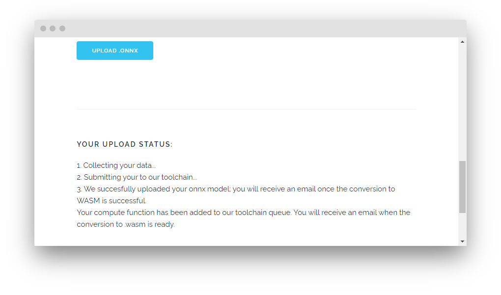
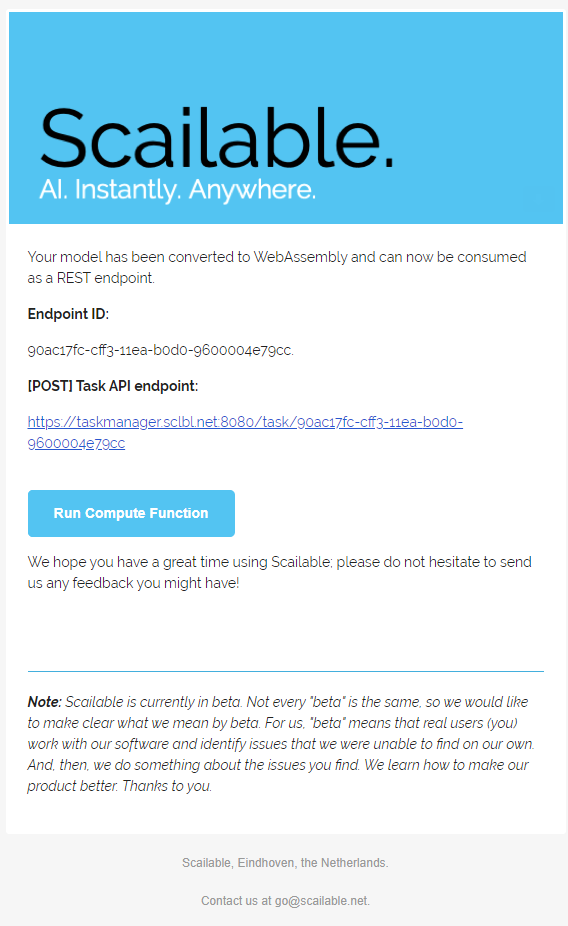
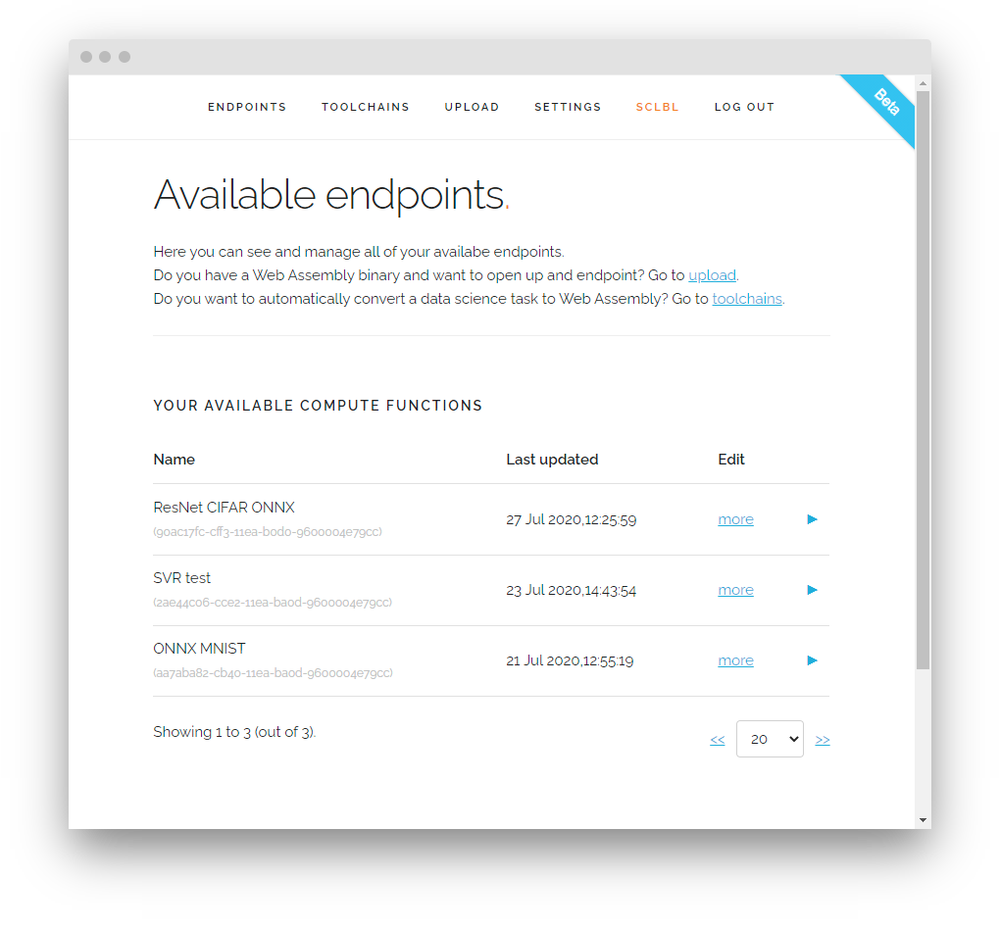
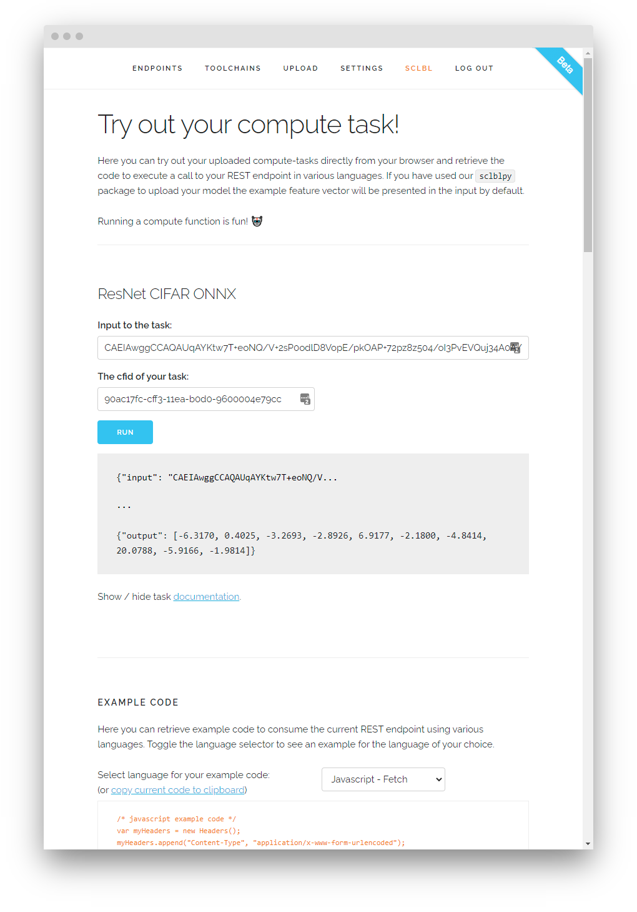
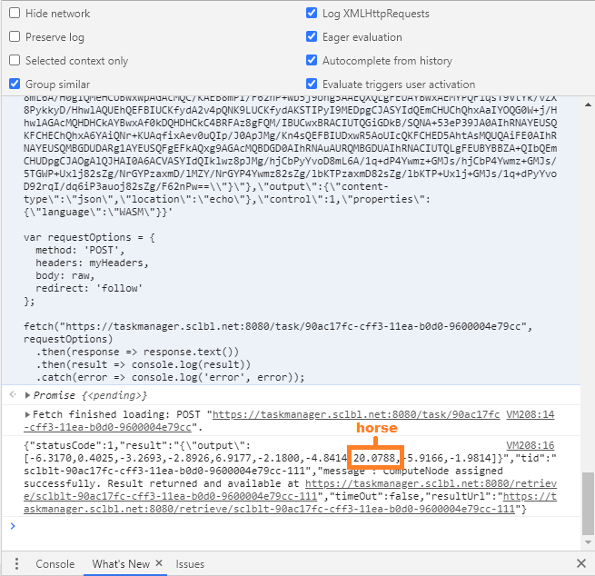

# PyTorch to Scailable WebAssembly Tutorial
> 26-07-2020; By the Scailable core team.

In this tutorial we demonstrate how to convert a [PyTorch](https://pytorch.org/) model to [WebAssembly](https://webassembly.org) by converting it to [ONNX](https://onnx.ai/) and running it through Scailable's [ONNX](https://onnx.ai/) toolchain. On completion of the conversion the model can be run, [among others](https://www.scailable.net/), on our RESTful cloud servers or within any modern browser.

In this tutorial we will cover the following steps:

1. [Preparing your pretrained PyTorch model](#PyTorch). First, we prepare a pretrained PyTorch model for conversion to ONNX.
2. [Converting the PyTorch model to ONNX](#ONNX). Next, we run the actual conversion of the PyTorch model to ONNX, clean the ONNX, and check whether its predictions still conform to the original PyTorch model.
4. [ONNX model to Scailable task](#Scailable). Finally, we demonstrate how to upload the ResNet ONNX model to Scailable and how to run the resulting Scailable task directly on our servers (or in your browser).

Note: The full Python source code of the current tutorial can be found in the [sources](sources) subdirectory, whereas the pretrained model's weights and CIFAR example images can be found in this tutorial's [resources](resources) subdirectory.

<a name="PyTorch"></a>

# 1. PyTorch model and CIFAR data set

In the current section, we introduce a [PytTorch](https://pytorch.org/) "[ResNet](https://medium.com/@shaoliang.jia/resnet-basics-9d75eabe499b)" type model [pretrained to classify](https://github.com/chenyaofo/CIFAR-pretrained-models) images in the [CIFAR-10](https://www.cs.toronto.edu/~kriz/cifar.html) data set. This classic dataset consists of 60000 32x32 color images in 10 classes, with 6000 images per class. 

### A. CIFAR data set

In the figure below, an overview of the classes in the dataset, together with 10 random images from each class:


We converted a subset of 100 (10 of each class) of the images into 32x32 PNG format. These converted images are available in the [resources/cifar](resources/cifar) subdirectory of the root PyTorch tutorial directory.

### B. Define the ResNet pretrained model

The pretrained ResNet 20-layer model we will be converting in the current tutorial [was kindly made available on GitHub](https://github.com/chenyaofo/CIFAR-pretrained-models) by [Chenyaofo](https://github.com/chenyaofo). 

The PyTorch ResNet model consists of two parts, the model weights, which are available in our tutorial's resources/weights directory, and the model definition. The latter reads as follows:

```python
'''
Kaiming He, Xiangyu Zhang, Shaoqing Ren, Jian Sun.
Deep Residual Learning for Image Recognition.
In CVPR, 2016.
'''

import torch.nn

def conv3x3(in_planes, out_planes, stride=1):
    """3x3 convolution with padding"""
    return nn.Conv2d(in_planes, out_planes, kernel_size=3, stride=stride, padding=1, bias=False)


def conv1x1(in_planes, out_planes, stride=1):
    """1x1 convolution"""
    return nn.Conv2d(in_planes, out_planes, kernel_size=1, stride=stride, bias=False)


class BasicBlock(nn.Module):
    expansion = 1

    def __init__(self, inplanes, planes, stride=1, downsample=None):
        super(BasicBlock, self).__init__()
        self.conv1 = conv3x3(inplanes, planes, stride)
        self.bn1 = nn.BatchNorm2d(planes)
        self.relu = nn.ReLU(inplace=True)
        self.conv2 = conv3x3(planes, planes)
        self.bn2 = nn.BatchNorm2d(planes)
        self.downsample = downsample
        self.stride = stride

    def forward(self, x):
        identity = x

        out = self.conv1(x)
        out = self.bn1(out)
        out = self.relu(out)

        out = self.conv2(out)
        out = self.bn2(out)

        if self.downsample is not None:
            identity = self.downsample(x)

        out += identity
        out = self.relu(out)

        return out


class CifarResNet(nn.Module):

    def __init__(self, block, layers, num_classes=10):
        super(CifarResNet, self).__init__()
        self.inplanes = 16
        self.conv1 = conv3x3(3, 16)
        self.bn1 = nn.BatchNorm2d(16)
        self.relu = nn.ReLU(inplace=True)

        self.layer1 = self._make_layer(block, 16, layers[0])
        self.layer2 = self._make_layer(block, 32, layers[1], stride=2)
        self.layer3 = self._make_layer(block, 64, layers[2], stride=2)

        self.avgpool = nn.AdaptiveAvgPool2d((1, 1))
        self.fc = nn.Linear(64 * block.expansion, num_classes)

        for m in self.modules():
            if isinstance(m, nn.Conv2d):
                nn.init.kaiming_normal_(m.weight, mode='fan_out', nonlinearity='relu')
            elif isinstance(m, nn.BatchNorm2d):
                nn.init.constant_(m.weight, 1)
                nn.init.constant_(m.bias, 0)

    def _make_layer(self, block, planes, blocks, stride=1):
        downsample = None
        if stride != 1 or self.inplanes != planes * block.expansion:
            downsample = nn.Sequential(
                conv1x1(self.inplanes, planes * block.expansion, stride),
                nn.BatchNorm2d(planes * block.expansion),
            )

        layers = []
        layers.append(block(self.inplanes, planes, stride, downsample))
        self.inplanes = planes * block.expansion
        for _ in range(1, blocks):
            layers.append(block(self.inplanes, planes))

        return nn.Sequential(*layers)

    def forward(self, x):
        x = self.conv1(x)
        x = self.bn1(x)
        x = self.relu(x)

        x = self.layer1(x)
        x = self.layer2(x)
        x = self.layer3(x)

        x = self.avgpool(x)
        x = x.view(x.size(0), -1)
        x = self.fc(x)

        return x

model = CifarResNet(BasicBlock, [3, 3, 3], num_classes=10)
```

### C. Merge model and weights

Now that we have defined the model's structure, we can load the pretrained weights, merge them with the model, and turn training mode off / evaluation mode on.

```python
# Load the weights from a file (.pth usually)
state_dict = torch.load('../resources/weights/cifar10-resnet20.pth')
model.load_state_dict(state_dict, strict=False)

# Evaluation mode on, training mode off. Needed because layers such as dropout and batchnorm behave differently in train and test procedures.
model.eval()
```

### D. Optional: Run a prediction with the fitted PyTorch model

Lets check if the pretrained model is indeed able to recognize random CIFAR images. To do so, we first need to define some helper functions that preprocesses the images in exactly the same way as during the original training:

```python
from PIL import Image
import numpy as np

# Class labels for CIFAR classes 0 to 9
classes = ('plane', 'car', 'bird', 'cat', 'deer', 'dog', 'frog', 'horse', 'ship', 'truck')

# Process the image
def process_image(image_path):
    # Load Image
    img = Image.open(image_path)
    
    # Get the dimensions of the image
    width, height = img.size
    
    # Turn image into numpy array
    img = np.array(img)
    
    # Make the color channel dimension first instead of last
    img = img.transpose((2, 0, 1))
    
    # Make all values between 0 and 1
    img = img/255

    # Normalize based on the preset mean and standard deviation
    img[0] = (img[0] - 0.4914)/0.2023
    img[1] = (img[1] - 0.4822)/0.1994
    img[2] = (img[2] - 0.4465)/0.2010
    
    # Add a fourth dimension to the beginning to indicate batch size
    # img = img[np.newaxis,:].astype(np.float16)
    img = img[np.newaxis,:]
    
    # Turn into a torch tensor
    image = torch.from_numpy(img)
    image = image.float()
    return image

# Use the model to retrieve the index of the predicted class
def predict(image, model):
    # Pass the image through our model
    output = model.forward(image)
    
    # Get the top predicted class
    probs, classes = output.topk(1, dim=1)

    return classes.item(), output

```

Now, we can check if the PyTorch model is able to predict, for example, the CIFAR **horse5.png** image:

<p align="center">

</p>

```python
# Process Image 
image = process_image("../resources/cifar/horse5.png")

# Give image to model to predict output
top_class = predict(image, model)

# Print the prediction
print("The PyTorch model predicts the image is a", classes[top_class] + ".")
```

On running the code, the PyTorch model successfully predicts a horse - yay!

```cmd
> tensor([[-6.3170,  0.4026, -3.2694, -2.8926,  6.9177, -2.1801, -4.8414, 20.0788,
         -5.9167, -1.9814]], grad_fn=<AddmmBackward>)

> The PyTorch model predicts the image is a horse.
```

<a name="ONNX"></a>

# 2. PyTorch to ONNX
The current section demonstrates how to convert any PyTorch model to the open ONNX format. To quote [ONNX.ai](https://onnx.ai/):

> **ONNX is an open format built to represent machine learning models.** ONNX defines a common set of operators - the building blocks of machine learning and deep learning models - and a common file format to enable AI developers to use models with a variety of frameworks, tools, runtimes, and compilers.
>
> Develop in your preferred framework without worrying about downstream inferencing implications. ONNX enables you to use your preferred framework with your chosen inference engine.

Since Scailable offers out-of-the-box [ONNX](https://onnx.ai/) to [WebAssembly](https://webassembly.org/) conversion, Scailable supports running any framework's models that can be converted to ONNX, from [TensorFlow](https://github.com/onnx/tensorflow-onnx) and [SkLearn](https://github.com/onnx/sklearn-onnx) to the subject of the current tutorial, [PyTorch](https://pytorch.org/docs/stable/onnx.html).

### A. Main PyTorch to ONNX conversion

The fitted [ResNet](https://en.wikipedia.org/wiki/Residual_neural_network) model of the previous section is all set to be converted to ONNX. ONNX export from Pytorch is done by tracing the graph; that is, it executes the graph once with an example or dummy input it's given. While executing the graph, it keeps track of PyTorch operations executed and then converts each of those operations to ONNX format. 

```python
# export the model
torch.onnx.export(model,                     # pytorch model
                  image,                     # example or dummy input
                  "cifar10-resnet20.onnx",   # name of onnx file                 
                  export_params=True,        # store trained parameter weights inside the model file
                  opset_version=7,           # the ONNX version to export the model to
                  do_constant_folding=True,  # whether to execute constant folding for optimization
                  input_names = ['input'],   # the model's input node name; "input" is the safest choice
                  output_names = ['output']) # the model's output node name; "output" is the safest choice
```

### B. Cleaning up

As a result of this code, you should now find an a `cifar10-resnet20.onnx` file in your working directory. However, the ONNX that the Torch package has generated is still a bit rough around the edges. So we clean it up using the following code:

```python
import onnx
import onnx.utils
from onnx import version_converter, optimizer
from onnxsim import simplify

# load the model
model_path     = './cifar10-resnet20.onnx'
optimized_model = onnx.load(model_path)

# set ONNX version and ONNX ir_version.
# scailable currently supports ONNX version <= 1.3,
# with ONNX IR version <= 3 and ONNX Operator Set <= 8
optimized_model = version_converter.convert_version(optimized_model, 7) 
optimized_model.ir_version = 3

# optimize, simplifiy and polish the model
optimized_model = optimizer.optimize(optimized_model)
optimized_model, check = simplify(optimized_model)
optimized_model = onnx.utils.polish_model(optimized_model)

# save optimized model
onnx.save(optimized_model, model_path)
```

### C. Optional: Run a prediction using the ONNX model

Let's see what the ONNX inference engine predicts:

```python
import onnxruntime
from onnx import numpy_helper

# load ONNX model
onnx_model = onnxruntime.InferenceSession('cifar10-resnet20.onnx')

# set already defined horse5.png image as input
onnxrt_inputs = {onnx_model.get_inputs()[0].name: image.numpy()}

# run onnx model
onnxrt_outs = onnx_model.run(None, onnxrt_inputs)

# print per class prediction value
print(onnxrt_outs[0])

# Print the prediction
print("The ONNX model predicts the image is a", classes[np.argmax(onnxrt_outs[0])] + ".")
```

Let's run the code, and see what the ONNX model predicts:

```cmd
> [[-6.317009    0.40259752 -3.2693486  -2.8926182   6.9177303  -2.1800907 -4.8414507  
    20.078842   -5.91668    -1.9814433 ]

> The PyTorch model predicts the image is a horse.
```

<p align="center">

</p>

With a value of 20.078842, our model picks "horse" again - looking good! We are now almost set to run the ResNet (ONNX) model on a Scailable node. The following section will explain how to get there.

<a name="Scailable"></a>

# 3. Running ONNX on Scailable  

Once you have followed the guidelines above and have generated a standards compliant ONNX v1.3 model, you can now just upload the resulting ONNX file on our website and send it an input image through, for instance, our RESTful interface. 

### A. Upload ONNX model

Now that you have both a suitable ONNX file you can generate a Scailable WebAssembly binary by logging in to the Scailable admin interface at [admin.sclbl.net](https://admin.sclbl.net/), selecting the [upload](https://admin.sclbl.net/upload.html,) tab, choosing "ONNX" type file upload, filling out all relevant fields, and clicking the `UPLOAD .ONNX` button:


On filling out the form and clicking the big blue button, [admin.sclbl.net](https://admin.sclbl.net/) will report that the ONNX file has been uploaded successfully:



When the Scailable ONNX toolchain has completed the conversion of ONNX to WebAssembly, you will receive an e-mail with a link to the demo page:

<p align="center">

</p>


Your Compute Function is now available in your list of "Available Endpoints" in your Scailable account:



### B. Generate an input string

Let's take our newly converted Scailable task for a spin! To do so, we first need to generate an input string. Here, we convert our **horse5.png** image to a base64 encoded ProtoBuf string by running:

```python
from onnx import numpy_helper
import base64

# convert numpy array to TensorProto protobuf tensor
output_tensor = numpy_helper.from_array(image.numpy())

# base64 encode the tensor
base64_input  = base64.b64encode(output_tensor.SerializeToString())

# print the resulting base64 string
print(str(base64_input, "ascii"))
```

... resulting in a 16405 characters long base64 string (shortened here):

```
CAEIAwggCCAQAUqAYKtw7T+eoNQ/V+2sP0odlD ... bKTP+Uxlj+GMJs/1q+dPyYvoD92rqI/dq6iP3auoj82sZg/F62nPw==
```

The full base64 example string based on the **horse5.png** image is available in the [resnet.cifar.model.base64.txt](resources/base64/resnet.cifar.model.base64.txt) file in the [resources/base64](resources/base64) subdirectory.

### C. Run a prediction using the Scailable compute task

On selecting the endpoint, you can now copy and paste this string into the "Input to the task" field, click the blue "RUN" button, and check the resulting output:



Super! The prediction equals the original output of the PyTorch model in **1.E**:

```cmd
{"output": [-6.3170, 0.4025, -3.2693, -2.8926, 6.9177, -2.1800, -4.8414, 20.0788, -5.9166, -1.9814]}
```

So our WebAssembly binary agrees: the image is indeed a horse, of course!

<p align="center">

</p>

To make it easy to incorporate our RESTful endpoints in your own code, you can now copy and paste source code examples to consume this REST endpoint in a variety of programming languages. Try it! Just copy the JavaScript Fetch example code and paste it in your browser's JavaScript console:

<p align="center">

</p>


Or in your Linux terminal, using cURL:


The same goes for any programming language, really. And if you don't want to run your Scailable WebAssembly model server-side, we've got you covered! Run your model client-side or on the edge - for example, in a browser using our [JavaScript webnode](https://github.com/scailable/sclbl-webnode).

--------


Thanks for your attention! Let us know if you have any suggestions please let us know by [creatinging a new issue](https://github.com/scailable/sclbl-tutorials/issues/new) or emailing us at [go at scailable dot net](mailto:go@scailable.net).

If you find any mistakes in our tutorials, please do [add an issue](https://github.com/scailable/sclbl-tutorials/issues/new) so we can fix it asap!


