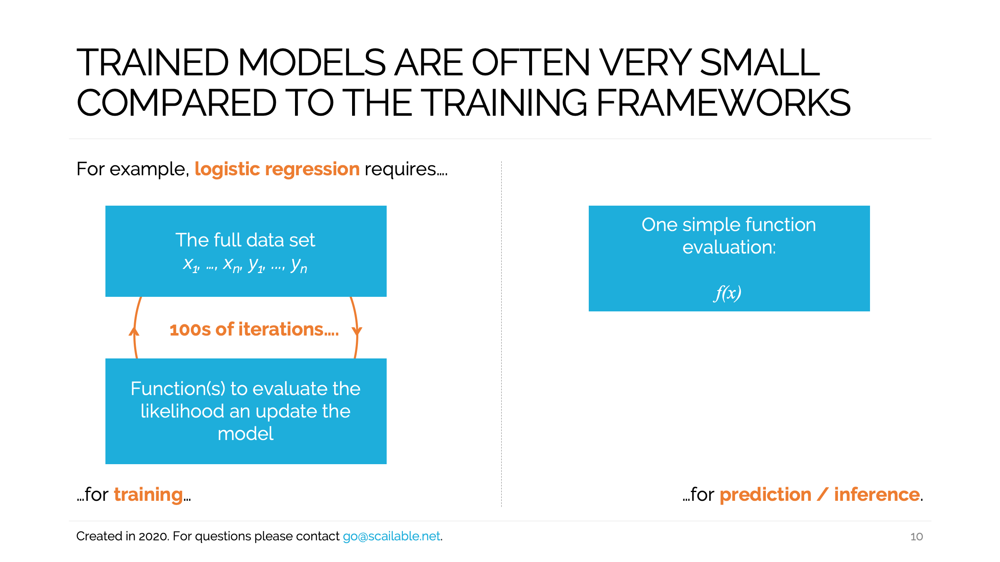
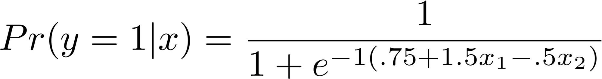

> 20-10-2020: Text for Medium / TowardsDataScience post accompanying the jupyter notebook exploring the differences between model training and model deployment as detailed in [this notebook](logistic-regression.ipynb)


# Exploiting the differences between model training and prediction
### Reducing the memory footprint and improving the speed and portability of deployed models.



> The code accompanying this post can be found [here](logistic-regression.ipynb).

In recent months we have helped many companies deploy their AI / ML models in various environments. We have contributed to model deployment in Healthcare, and, in the last few months, we have helped several companies move trained models to different types of IoT devices. Particularly in the latter case, requirements are often strict: both the number of compute cycles and the available memory are often limited. 

In this post I clarify how we make sure that models trained using standard ML libraries such as PyTorch, Scikit-learn, and Tensorflow can be deployed efficiently on various edge devices. To make things tangible, we will examine the training and deployment of a simple logistic regression model. However, most of what we discuss here transfers directly to more complex models.

## Model training
To illustrate the differences between model training and deployment, let's start by simulating some data. The code below generates 1000 observations according to the following simple model:



```python
import numpy as np
np.random.seed(66)  # Set seed for replication

# Simulate Data Generating Process
n = 1000  # 1000 observations
x1 = np.random.uniform(-2,2,n)  # x_1 & x_2 between -2 and 2
x2 = np.random.uniform(-2,2,n)
p = 1 / (1 + np.exp( -1*(.75 + 1.5*x1 - .5*x2) ))  # Implement DGP

y = np.random.binomial(1, p, n)  # Draw outcomes

# Create dataset and print first few lines:
data = np.column_stack((x1,x2,y))
print(data[:10])
```

After generating the data, we can focus on fitting a model. We simply use `sklearn`'s `LogisticRegression()` function to do so:

```python
from sklearn.linear_model import LogisticRegression
mod = LogisticRegression().fit(data[:,[0,1]], np.ravel(data[:,[2]]))
```

However, here it's useful to pauze and briefly consider what is happening under the hood. Logistic regression models, as is true for many other interesting ML models, are trained iteratively. To train the model, `sklearn` (or any other package providing similar functionality) will have to implement several functions:

1. Some sort of score function indicating the fit of the model. This might be an error function, or a maximum likelihood function.
2. A function which updates the parameters of the fitted model from one iteration to the next.

The training process will effectively use both functions **iteratively**: Initially, the parameters of the model are randomly instantiated. Next, the score of the model is checked. If the score is deemed insufficient (often because it has improved compared to the previous iteration), the model parameters are updated and the process is repeated. 

Even for this simple model, `sklearn` took several passes through the dataset. The following code gives the number of iterations (seven for this choice of seed):

```python
## Print the number of iterations
print(f'The number of iterations is: {mod.n_iter_}.')
```

Thus, **to train a model** we need access to the data, several utility functions, and we need multiple iterations / passes through the dataset. In general, this training process is computationally demanding which explains why for complex models we resort to parallel computations and GPU or NPU acceleration to carry it out in a reasonable time. Luckily, however, when training models, the fairly complex logic required to do so is abstracted away by the various ML libraries we use.

## Generating predictions

Comapare this with generating *predictions* from an already fitted model (often called *inferences*, but I find the latter term confusing as its use in statistics is different, so I am sticking to predictions). By the time the model is fitted, effectively all we need to generate predictions in this case is the logistic regression function -- the same mathematical function we used to generate data in our example above -- and the three parameters of the fitted model. These are easy to retrieve:

```python
b = np.concatenate((mod.intercept_, mod.coef_.flatten()))
print(b)
```
and the parameters end up being relatively close to the values we used for data generation: `[ 0.84576563  1.39541631 -0.47393112]`.

Furthermore, in most deployment situations, we mostly end up evaluating the model with only a single input: in this case, a numeric vector of length two. So really, if we want to deploy a model we don't need the fitting functions, we don't need the data, we don't need the iterations. Thus, **to generate predictions**, we merely need a simple and efficient implementation of the mathematical function involved in generating the prediction.

## Exploiting the differences for (edge) deployment
"So what?" you may ask. Why should you care about the nitty-gritty details involved in training and prediction when modern model training tools abstract away all these details? Well, because by the time you would like your models to be efficiently deployed, for example when you need them to run fast on small devices, you better exploit the differences above.

For the sake of argument, contrast the following two methods of model deployment (i.e., putting the trained model into production such that you can use its predictions):

1. **Docker container deployment of sklearn as a REST service:** This approach is simple and often used: we start up a docker image containing the python stack. In the case of the example logistic regression model above, `sklearn`. Next, we create a REST endpoint that consumes the fitted model's `mod.predict()` function to generate results.
2. **Scailable WebAssembly Deployment:** More recent, but not at all harder, is converting the fitted model to WebAssembly (using a service like the one offered by [Scailable](https://www.scailable.net)), and deploying the .WASM executable containing *only the logic needed for prediction* in a minimal WebAssembly runtime. The automatically generated binary will contain only the necessary logistic function (in this case) and the estimated parameters. The binary might be deployed on a server (and thus consumed through REST calls), but, using the [various runtimes available](https://github.com/scailable/sclbl-webnode), it could also run on pretty much any edge device.

Clearly, the first deployment process is close to ``what we know'' as data scientists. It is nice to work directly with the tools we are used to. In many respects, it works: we can generate predictions using calls to the REST endpoint. The second solution is further away from our standard practice, and it is useless for model training (i.e., there are no "WebAssembly packages to train models...", if that sentence even meant anything at all). However, we still think it should be preferred: the second setup exploits the differences between training and prediction to make model deployment better in several respects:

* **Memory footprint:** The first of the two options above will need *at least* 75Mb for the container (and getting it that small [takes a lot of engineering](https://jilongliao.com/2018/08/09/Reduce-Docker-Image-Size/), it is more common to have containers that approach 1Gb in size). In this case the stored model itself is small (~2Kb), and thus the container comprises the largest chunk of the memory footprint of the deployment (note this might not be true for, e.g., large neural networks). Conversely, the WebAssembly runtime can be brought down to less than 64**Kb**. The WebAssembly binary itself is admittedly larger than the stored `sklearn` model (~50kb), but it now contains *all that is necessary to generate predictions*. Thus, while the first deployment option takes at least 75Mb, the second takes less than .1Mb. Magnitudes smaller.
* **Speed:** Consuming a REST endpoint running in a Docker container which is firing up all the stuff needed for training does not compare favourably in terms of execution time when compared to efficient WebAssembly deployment. [Here](https://www.scailable.net/demo/bench/) are some speed comparisons for various models, but, needless to say, exploiting the differences between training and prediction and solely putting the bare necessities for prediction into production increases the speed by which these predictions are generated by an order of magnitude.

So, smaller memory footprints and quicker execution. That's nice for several reasons; for one because we might like to contribute to the Paris Climate Accord and thus deploy models efficiently. But, it is also appealing because small memory and speed are what we need when putting model into production on the Edge: Good luck deploying your Docker container on (e.g.,) a ESP32 MCU board. [With Scailable and WebAssembly this was a piece of cake](https://www.scailable.net/demo/bench/).


